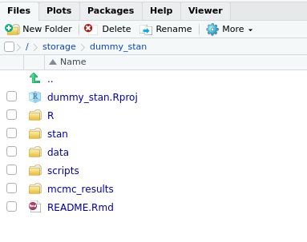

```{r setup, include=FALSE}
options(htmltools.dir.version = FALSE)

knitr::opts_chunk$set(dpi=300)

```


# Bayesian Data Analysis

Three steps (Gelman et al 2015):

1. __Specify a full probability model__; a joint probability distribution incorporating what we know about the problem we are studying.
2. Update this model by __conditioning on the data__, using Bayes Rule to obtain posterior distributions of quantities of interest (parameters or predictions of new data).
$$
p(\theta | y) = \frac{p(y | \theta) p(\theta)}{\int p(y | \theta) p(\theta) d\theta}
  \propto p(y|\theta)p(\theta)
$$

3. __Evaluating the fit of the model__ a nd the reasonableness of its implications


---
# Stan

`Stan` (named after Stanisław Ulam) is a computational tool that helps with all three of these steps. 
1. A modelling language for specifying probablity models
2. A posterior sampler employing efficient Hamiltonian Monte-Carlo (HMC) methods
3. A set of tools for exploring and analysing these posterior samples.

## Interfaces
- Command line
- __R__
- Python

--
- Julia, Stata, Mathematica, Matlab, C++ ...

---
class: space
# Overview

1. Hamitonian Monte Carlo
2. Writing a Model in Stan
3. Diagnosing problems
4. Resources


--
This talk draws on material from Neal (2011), Gelman et al (2015), and from the Stan documentation


---
class: space
# MCMC

- We want to know about the posterior distribution $p(\theta | y)$
- This is often analytically intractable.
- Monte Carlo Markov Chain (MCMC) sampling is a technique for instead obtaining a __sample__ from the posterior distribution
- Starting from an arbitrary point in the parameter space, set up a sequence of random moves that is guaranteed to converge to the posterior distribution


--
Provides us with a collection of samples from the posterior with which we can compute summaries (means, quantiles, etc.)

---
# MCMC algorithms

## Metropolis Algorithm

- Generate new point from a proposal distribution $J(\theta^{*} | \theta^{t-1})$.
- Calculate ratio of densities $r= \frac{p(\theta^{*}|y)}{p(\theta^{t-1}|y)}$
- Accept the proposal as the next point $\theta^{t}$ with probability $r$.

_Often requires many iterations to converge on the posterior_

## Gibbs Sampler
- Iteratively samples individual parameters or blocks of parameters conditional on the latest values of all the other parameters. 


_Requires derivation of conditional distributions - e.g. through choice of conjugate prior distributions_


---
class: space

# Hamiltonian Monte Carlo: Intuition
Hamiltonian Monte Carlo is a sub-set of Metropolis-Hastings algorithm, using derivative information to propose a new state (Neal 2011).

--

This allows our sampler to travel more quickly over the parameter space than the other methods.

--

We simulate from the posterior as we would if we were simulating the movement of a ball over a landscape.

--

The framework borrowed in order to do this comes from physical mechanics, and is called Hamiltonian Mechanics.


[Thomas Wiecki's blog](https://twiecki.io/blog/2014/01/02/visualizing-mcmc/)

---
# Hamiltonian Monte Carlo: Intuition


The ball's position is our vector of parameters - describing its position in parameter space.

--

The landscape is the (negative) log posterior density - a pit or valley with the posterior mode at the bottom.


```{r, echo=F, fig.width=5, fig.height=2, warning=F, message=F}
library(tibble)
library(ggplot2)
xx <- seq(-5,5,0.1)

y <- -dnorm(xx, log=T)
pit_df <- tibble(theta=xx,`-log(p(theta | y )` =y)

ggplot(pit_df, aes(x=theta,y=`-log(p(theta | y )`)) + 
  geom_line(size=2.5) +
  theme_bw(base_size=13) +
  theme(panel.grid=element_blank(),rect=element_blank()) + 
  geom_point(y=y[65] + 1 , x=xx[65], size=5, col="red")


```


---
# Hamiltonian Dynamics
The Hamiltonian describes total energy of a dynamic system: Potential Energy + Kinetic Energy (see Neal 2011).

A conserved quantity, as energy is neither destroyed nor created.

\begin{equation*}
H(p,q) = U(q) + K(p)
\end{equation*}

- $U(q)$ is the potential energy - related to the height from the 'ground'
- $K(p)$ is the kinetic energy - related to the speed and mass of the particle

--
- $q$ is the position vector, $p = mv$  is the momentum vector
- $m$ = mass; $v$ = velocity


--
Equations of motion (how the system changes with time)
\begin{equation*}
\frac{dq_i}{dt}= \frac{\partial H}{\partial p_i}  \qquad
\frac{dp_i}{dt}= - \frac{\partial H}{\partial q_i}
\end{equation*}


---
# Hamiltonian Monte Carlo
To adapt this framework to the problem of sampling from a posterior, we introduce auxiliary variables $\phi$ representing momentum and sample from the joint distribution of the two sets of variables (Neal 2011).
\begin{align*}
H(\phi,\theta) &= U(\theta) + K(\phi)\\
               &= -\text{log}(p(\theta | y)) - \text{log}(p(\phi)) \\
\phi &\sim \text{N}(0,M) \qquad  
\end{align*}

For each HMC step, we sample a random momentum $\phi$ from a normal distribution, and trace out the resulting trajectory, using the equations of motion for our system.
\begin{equation*}
\frac{d\theta_i}{dt} = \frac{\partial \text{log}(p(\phi))}{\partial \phi_i} = \frac{\phi_i}{m_i} \qquad
\frac{d\phi_i}{dt}   = \frac{\partial \text{log}(p(\theta | y))}{\partial \theta_i}
\end{equation*}

This is like giving our ball a push in a random direction and seeing where it ends up after a certain time.

---
# Transition
In order to trace out a trajectory, we need to discretise our system.
HMC uses a 'leapfrog integrator' to obtain 'future' values of the parameters, using some small timestep $\epsilon$. 

- Select a starting point
- Draw momentum values from $p(\phi)$
- Do half an update for $\phi$
\begin{equation*}
\phi_{t +\epsilon} = \phi_{t} + \frac{\epsilon}{2} \frac{\partial \text{log}(p(\theta | y))}{\partial \theta_{t}}
\end{equation*}
- Alternate (leapfrog) full updates for $\phi$ and $\theta$ for $L-1$ steps.
\begin{equation*}
\theta_{t +\epsilon} = \theta_{t} + \epsilon M^{-1}\phi \qquad
\phi_{t +\epsilon} = \phi_{t} + \epsilon \frac{\partial \text{log}(p(\theta | y))}{\partial \theta}
\end{equation*}
- Do final half-update for $\phi$ as above.

---

# Acceptance

At the end of the trajectory, we have generated a new candidate point, often a long way from where we started from.

As with Metropolis-Hastings, accept the new point with probability $\text{min}(1, r)$, with:
\begin{equation*}
r= \frac{p(\theta^{*}|y)p(\phi^{*})}{p(\theta^{t-1}|y)p(\phi^{t-1})}
\end{equation*}

If the Hamiltonian was conserved exactly, this would always be one.


--
But error in the leapfrog integrator caused by discretisation means it isn't.

Generally, the ideal acceptance rate is high: c.65%-80%, vs  c.23% for MH, resulting in fewer 'wasted' calculations.

---
# Sampling Parameters
HMC involves sampling parameters $L$ (number of steps), $\epsilon$ (stepsize) and $M$ (mass).
### No U-Turn Sample (NUTS)
Number of leap-frog steps $L$ can be set adaptively by running the leapfrog integrator until the trajectory begins to turn around (Hoffman and Gelman 2014)

Terminates when the dot-product of the change in position and the momentum is negative:
\begin{equation*}
(\theta_{t+L\epsilon} - \theta_{t}) \phi_{t+L\epsilon} < 0
\end{equation*}

Additional procedures are needed to ensure detailed balance.


Burn-in phases used to set $\epsilon$ and $M$ by targeting an acceptance rate.
---
# Stan
Stan is a software tool for Bayesian Inference using Hamiltonian Monte Carlo.


- Writing a stan model involves writing commands to define joint log-density $\text{log} \; p(y, \theta) = \text{log} \; p(y | \theta) + \text{log} \; p(\theta)$ (up to constant factors).
- Stan uses *auto-differentiation* techniques to obtain the partial derivatives needed for HMC
  + Any stan program is made up of combinations of elementary operations, for which the derivative is known
  + Repeated application of the chain rule means that the derivative of whole expressions can be found automatically

--
- The model is turned into a c++ program to sample the posterior
- The No U-Turn Sampler (NUTS) is used by default, although plain HMC is also available

---
# Stan - setup and installation

We will work with the R interface.


For most systems, just install the R package:

```{r,eval=F}
install.packages("rstan", dependencies = T)
```

Detailed instuctions for different interfaces are given on the stan website.
[https://mc-stan.org/users/interfaces/index.html](https://mc-stan.org/users/interfaces/index.html)

Because `stan` needs later `c++` compilers, sometimes the version of your compiler can cause problems (gcc 4.9.1 seems to work on `iridis4`).

---
# Setting up a stan project

Stan models can be saved as plain text files, saved with `.stan` extensions.

Rstudio will recognise and syntax-colour `.stan` files.

They can also be written within an `R` script as character strings (not recommended)



---
# Workshop files

- Go to my github page: [https://github.com/jasonhilton/stan_soton](https://github.com/jasonhilton/stan_soton)

--
- If you are using your own machine and you have git, you can clone the repository.

- Otherwise, click on the green "clone or download" button. 

- Download and extract the files to somewhere convenient.

- If you want to use Rstudio, set up a project in the main folder of the repository

- Otherwise, set your working directory to this folder.

---

#Modelling Language
Syntax is similar to R except all statements and declarations must end with `;` 

In the latest version of stan, the assignment operator `=` is preferred to `<-`.


```{r, eval=F}
z = y + x;
for(i in 1:N){
  if(i==2){
    z[i] = exp(x[i]);
  }
}
```

---
# Declarations and Variable Types
All variables and constraints must be declared before use.

```{r, eval=F}
int x;
real<lower=0> sigma;
real<lower=0,upper=1> phi;
vector[N] y;
matrix[N, k] X;
```

Stan must know the size, type and name of a variable before you can assign to it.

Parameter constraints are also applied at the declaration stage.


---
# Writing Stan Programs
We will work with the simplest example first:

\begin{align*}
y &= \alpha + X\beta + \epsilon \\
\epsilon &\sim N(0, \sigma^2) \\
\beta &\sim U(-\infty  , \infty) \\
\sigma &\sim U(0  , \infty)
\end{align*}

Stan programs consist of several different model blocks.
- __data__
- transformed data
- __parameters__
- transformed parameters
- __model__
- generated quantities


---
# Data

Declares observed quantities passed into stan from outside (e.g. from R)
```{r,eval=F}
data{
  int N;
  int k;
  matrix[N, k] X;
  vector[N] y;
}
```


## Parameters
Declares the parameters in the model and their __constraints__.
```{r,eval=F}
parameters{
  real alpha;
  vector[k] beta;
  real<lower=0> sigma;
}
```

---
# Model Constraints

- Parameters declared with constraints are transformed back to the real space before sampling
- In order to maintain the correct probability model, `stan` adjusts for the changes of variables automatically by adding the appropriate Jacobian adjustment to the log-density.
- Priors should match your constraints. If you have declared a prior with only positive support to a unconstrained parameter, the sampler will not initialise!


---


# Model Block

- Priors and likelihoods can be written similarly as in BUGS, using $\sim$
to mean "is distributed".
- However in stan, this is more correctly a shorthand for the command "increment the log probability"
 +  Stan uses variances not precisions in normal distributions.
 +  Sampling statements (and other statements) can be 'vectorised'

```{r, eval=F}
model{
  for (i in 1:N){
    y[i] ~ normal(alpha + X[i] * beta, sigma);
  }
}
```


---
# Model Block
Equivalently:-
```{r, eval=F}
model{
    y ~ normal(alpha + X * beta, sigma);
}
```

Equivalently:-
```{r, eval=F}
  target += normal_lpdf(y | alpha + X * beta, sigma);
```


---
# Priors And Likelihoods
If possible, distributions should only be placed on __observed quantities__ or __parameters__ (declared in the parameters block). 

If you put a distribution on a function of the parameters you will need to add an appropriate Jacobian adjustment manually using `target +=`.


---
# Preparing stan inputs

Simulate some data
```{r}
x1 <- seq(-5,5, 0.1)
x2 <- rnorm(length(x1))
X <- cbind(x1,x2)
Beta <- c(1, -3) 
alpha <- 10
sigma_e  <- 0.5 
y <- rnorm(length(x1), alpha +  X %*% Beta, sigma_e)
```

Create input list
```{r}
stan_input_data <- list(
  N=dim(X)[1],
  k=dim(X)[2],
  X=X,
  y=y
)
```

---
# Running the Model
Running the model from R is easy.


```{r, eval=F}
library(rstan)
stan_out <- stan(file="stan/linear_regression.stan",
                 data=stan_input_data,
                 iter=2000,
                 chains=2,
                 cores=2,
                 thin=1)
```

---
# Model output

```{r readlr, include=F}
library(rstan)
lr_stan <- readRDS("mcmc_results/linear_regression.rds")
stan_out <- lr_stan$stan_out
stan_input_data <- lr_stan$stan_input_data
```

```{r}
stan_out
```

---
# Traceplots 
```{r, fig.height=4}
stan_trace(stan_out)

```

---
# Sampling Diagnostics

```{r, fig.height=4}
stan_ac(stan_out)

```

---
# Convergence


```{r, fig.height=4, message=F}
stan_rhat(stan_out)

```

---
# Posterior Predictive Distribution

We can sample from the posterior predictive distribution for the observed data in the 'generated quantities' block

```{c, eval=F}
generated quantities {
  vector[N] y_rep;
  for (i in 1:N){
    y_rep[i] = normal_rng(alpha + X[i] * Beta, sigma)
  }
}
```

---
# Checking the Posterior
The R packages `bayesplot` provides some nice graphical tools for checking posteriors distributions against data distributions


```{r, include=F}
lr_stan <- readRDS("mcmc_results/linear_regression_gen_quan.rds")
stan_out <- lr_stan$stan_out
stan_input_data <- lr_stan$stan_input_data

```


```{r, cache=F, message=F, warning=F, fig.height=2.5, cache=T}
library(bayesplot)
y_rep <- as.matrix(stan_out, "y_rep")
y_real <- stan_input_data$y
ppc_dens_overlay(y_real, y_rep) + theme_bw(base_size = 16)

```

---
# Diagnosing problems

## Folk theorem of statistical computing
> "Computational problems are often model problems in disguise"

[https://statmodeling.stat.columbia.edu/2008/05/13/the_folk_theore/](https://statmodeling.stat.columbia.edu/2008/05/13/the_folk_theore/)


--
Two types of problems
- Failure to sample due to initialisation problems
- Sampling is deficient some how and stan emits a warning.

---
# Initialisation problems

Errors like:

```
Rejecting initial value:
...

Initialization between (-2, 2) failed after 100 attempts.
```

Are often because of problems with constraints and boundaries or flat posteriors.

--
- Try ensuring all parameters have weakly informative priors
- Double check that prior supports match parameter constraints

---
# Warnings about samples
- A warning about `tree depth` means that NUTS iterations are reaching the maximum number of steps without turning around. This may lead to long run times. 
  + __This could be due to high correlations or indentifiability problems__


--
- A warning about divergent transitions means that the Hamiltonian varies a very large amount over the some trajectories. Some areas of the posterior may not have been visited  
 + See [https://mc-stan.org/users/documentation/case-studies/divergences_and_bias.html](https://mc-stan.org/users/documentation/case-studies/divergences_and_bias.html)   
 + __Change adapt_delta parameter__
 + __Reparameterise__


---
# Warnings about samples
- Warnings about $\hat{R}$ indicate that your chains have not converged.

--
- Warnings about ESS (effective samples size) suggest high autocorrelations in your chains.


- Solutions to these problems may be to  __Run longer chains__ or to __Reparameterise__

[https://mc-stan.org/misc/warnings.html](https://mc-stan.org/misc/warnings.html)


---
# 8 Schools example

Simple examples based on a [case study by Betancourt](https://mc-stan.org/users/documentation/case-studies/divergences_and_bias.html) 

It illustrates some problems often encountered with stan and how to over come them.

- Pupil data from a 8-schools collected in the form of 8 mean scores with associated standard deviations.

```{r}
schools_dat <- list(J = 8, 
                    y = c(28,  8, -3,  7, -1,  1, 18, 12),
                    sigma = c(15, 10, 16, 11,  9, 11, 10, 18))
```

- Task: fit a hierarchical model to borrow strength across the schools

\begin{align*}
\mu &\sim N(0,5) \\
\tau &\sim \text{Cauchy}(0, 5)^{+} \\ 
\theta_n &\sim N(\mu,\tau) \\
y_n &\sim N(\theta_n, \sigma_n)
\end{align*}

```{r, include=F, cache=T}

schools_dat <- list(J = 8, 
                    y = c(28,  8, -3,  7, -1,  1, 18, 12),
                    sigma = c(15, 10, 16, 11,  9, 11, 10, 18))

# Example based on https://mc-stan.org/users/documentation/case-studies/divergences_and_bias.html


stan_out <- stan(file="stan/eight_schools.stan",
                 data= schools_dat,
                 iter=2000,
                 cores=2,
                 chains=2)

```

---
# Examining Divergences

This is a 'centred parameterisation', and in this case it exhibits divergences, indicating the curvature of the posterior differs considerably in different areas of the posterior. 

We can examine a scatter plot of the posterior over two parameters using the code below.

```{r, eval=F}
np <- nuts_params(stan_out)
lp <- log_posterior(stan_out)


all_pars <- as.array(stan_out)

bayesplot::mcmc_scatter(all_pars, pars = c("theta[1]", "tau"), np=np)


```


---
# Scatter with divergences

Red dots indicate divergent transitions


```{r, echo=F, cache=T, fig.height=4}
np <- nuts_params(stan_out)
lp <- log_posterior(stan_out)


all_pars <- as.array(stan_out)

bayesplot::mcmc_scatter(all_pars, pars = c("theta[1]", "tau"), 
                        transformations = list(tau=log),
                        np=np)


```


---
# Good Parameterisations

A non-centred parameterisation:

\begin{align*}
\mu &\sim N(0,5) \\
\tau &\sim \text{Cauchy}(0, 5)^{+} \\
\tilde{\theta_n} &\sim N(0,1) \\
\theta_n &= \mu + \tau * \tilde{\theta_n} \\
y_n &\sim N(\theta_n, \sigma_n) 
\end{align*}


Fit this parameterisation and examine the differences.

---

```{r, echo=F, cache=T, fig.height=4}


stan_out <- stan(file="stan/eight_schools_non_centred.stan",
                 data= schools_dat,
                 iter=2000,
                 cores=2,
                 chains=2)


np <- nuts_params(stan_out)
lp <- log_posterior(stan_out)


all_pars <- as.array(stan_out)

bayesplot::mcmc_scatter(all_pars, pars = c("theta_tilde[1]", "tau"), 
                        np=np, transformations = list(tau=log))

```

Changing the geometry of the parameter space makes a big difference to HMC sampling.


---
# Other Features

Stan provides other inference methods:
- Quasi-Newton's method based optimiser (LBFGS) making use of derivatives
- Normal and Laplace aproximations 
- Variational Bayes (experimental!)


Stanarm (*A*pplied *R*egression *M*odelling) provides drop-in Bayesian equivalents for common R modelling functions (e.g glm --> stan_glm)

Shinystan gives an interactive GUI for model visualisation and checking. This can be used with any mcmc programme (bugs, jags, SAS etc).


---
# Resources 

[Stan website](https://www.mc-stan.org) for vignettes, lots of example models, manuals, references.

[Gettings started with Rstan](https://github.com/stan-dev/rstan/wiki/RStan-Getting-Started)

[Function reference](https://mc-stan.org/docs/2_21/functions-reference/index.html)

[User Guide](https://mc-stan.org/docs/2_21/stan-users-guide/index.html)

[Case Studies](https://mc-stan.org/users/documentation/case-studies.html) Around 30 examples spanning many disciplines.

[Recommendations on prior choices](https://github.com/stan-dev/stan/wiki/Prior-Choice-Recommendations)

[Stan forums](https://discourse.mc-stan.org/)

---
# References

Betancourt, M (2017) A Conceptual Introduction to Hamiltonian Monte Carlo. arXiv.

Gelman, A. et al (2015) Bayesian Data Analysis. CRC Press. Boca Raton 

Gelman (2006) Prior distributions for variance parameters in hierarchical models. Bayesian Anaylsis. 1, 3. p515-533.
http://www.stat.columbia.edu/~gelman/research/published/taumain.pdf

Hoffman and Gelman (2014) The No-U-Turn sampler: Adaptively setting path lengths in Hamiltonian Monte Carlo. Journal of Machine Learning Research 15, p1593-1623

McElreath (2016) Statistical Rethinking. CRC Press. Boca Raton.

Neal (2011) MCMC using Hamiltonian Dynamics in *Handbook of Monte Carlo Markov Chain.* Brooks, S., Gelman, A. Jones. G.L. and Meng, X-L (eds). CRC Press. [https://www.mcmchandbook.net/HandbookChapter5.pdf](https://www.mcmchandbook.net/HandbookChapter5.pdf). Also on arXiv.


